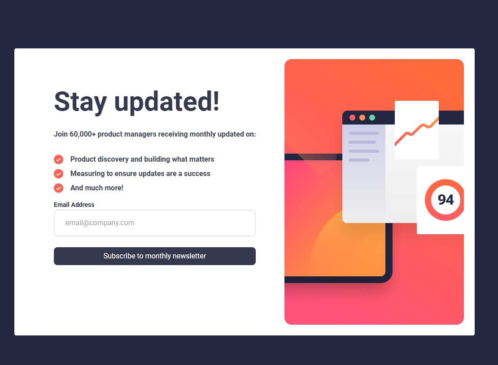
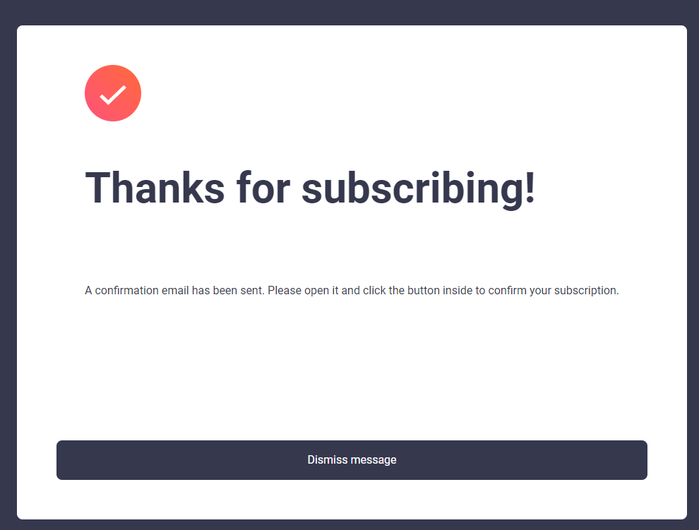
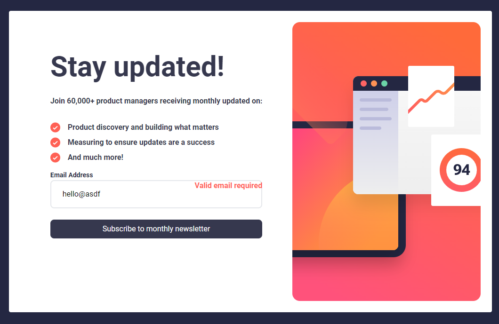
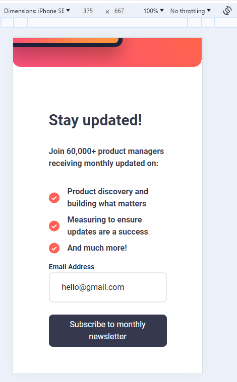
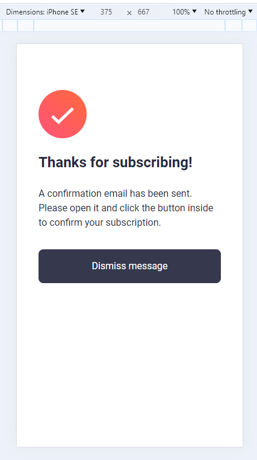
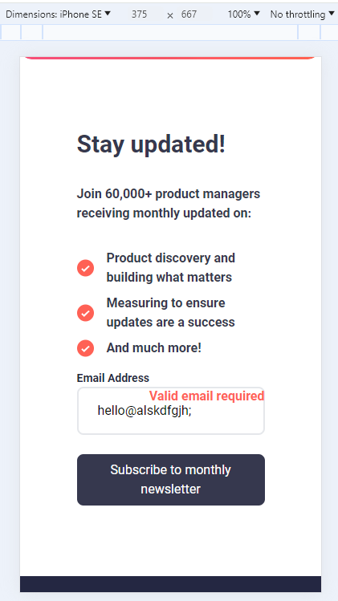

# Newsletter sign-up form with success message solution

This project was aimed at creating a newsletter signup with a success message page. During this project, I used ReactJS, TailwindCSS, Vite and CSS. I worked through each step of the process to build my application. 

This is a solution to the [Newsletter sign-up form with success message challenge on Frontend Mentor](https://www.frontendmentor.io/challenges/newsletter-signup-form-with-success-message-3FC1AZbNrv). Frontend Mentor challenges help you improve your coding skills by building realistic projects.

## Table of contents

- [Overview](#overview)
  - [The challenge](#the-challenge)
  - [Screenshot](#screenshot)
  - [Links](#links)
- [My process](#my-process)
  - [Built with](#built-with)
  - [What I learned](#what-i-learned)
  - [Continued development](#continued-development)
  - [Useful resources](#useful-resources)
- [Author](#author)

## Overview

### The challenge

Users should be able to:

- Add their email and submit the form
- See a success message with their email after successfully submitting the form
- See form validation messages if:
  - The field is left empty
  - The email address is not formatted correctly
- View the optimal layout for the interface depending on their device's screen size
- See hover and focus states for all interactive elements on the page

### Screenshot

Desktop:

Mobile:

### Links

- Solution URL: [Add solution URL here](https://your-solution-url.com)
- Live Site URL: [Netlify Solution](https://newsletter-signup-lav.netlify.app/)

## My process

### Built with

- Semantic HTML5 markup
- CSS custom properties
- Flexbox
- CSS Grid
- Mobile-first workflow
- [React](https://reactjs.org/) - JS library

### What I learned

I learned many things during my process of creating this application.

1. React Router Dom - It is an npm package that enables you to implement dynamic routing in a web application. It is used to build single-page applications where the content is dynamically fetched based on the URL. The advantages are it is fast and the application has better performance. Router is the parent component that is used to store all the other components. Routes are used to define the navigation paths within a SPA. Route checks the current URL and displays the component with that exact path. Link is used to create links to different paths.
2. Validating Email - I used a function named validateEmail that took a single argument of email. I used validate.test(email) to test if the string matched the pattern defined by the regex. The variable validate is a regular expression tha tmatches the basic structure of an email. The method returns true if the email argument matches this pattern and false otherwise.
3. handleSubmit function - The handleSubmit takes an argument and it determines the best course of action based on user input. It prevents default of the page loading, validates email and returns the appropriate response based on what is entered. It will navigate the user to the thank you page if all is complete and passes all validation checks.
4. Refractoring code for success variable - As I went through my code to add comments regarding function, I realized I had included a success variable with conditional rendering that did not add to the project. Originally, when the success variable was set to true then it would conditionally render a "Thank you for subscribing!" message. After working through the project, I added another thank you component page that would appear after submitting your valid email. Thus this variable and it's code was not needed anymore. I removed the extra code and the program worked smoothly.

### Continued development

I will continue to work on my knowledge of routing in ReactJS, Javascript principles and much more.

### Useful resources

- [Google Font Roboto](https://fonts.google.com/specimen/Roboto) - Design required Google Font Roboto
- [TailwindCSS Button Styling] (https://v1.tailwindcss.com/components/buttons) - Resource for button styling
- [Frontend Newsletter Reference] (https://github.com/roidzuh/frontend-mentor/tree/main/newsletter-sign-up-form)
- [React Router Dom] (https://www.geeksforgeeks.org/what-is-react-router-dom/)

## Author

- Website - [Laura V](www.lauradeveloper.com)
- Frontend Mentor - [@lavollmer](https://www.frontendmentor.io/profile/yourusername)
- Github - [@lavollmer](https://github.com/lavollmer)
